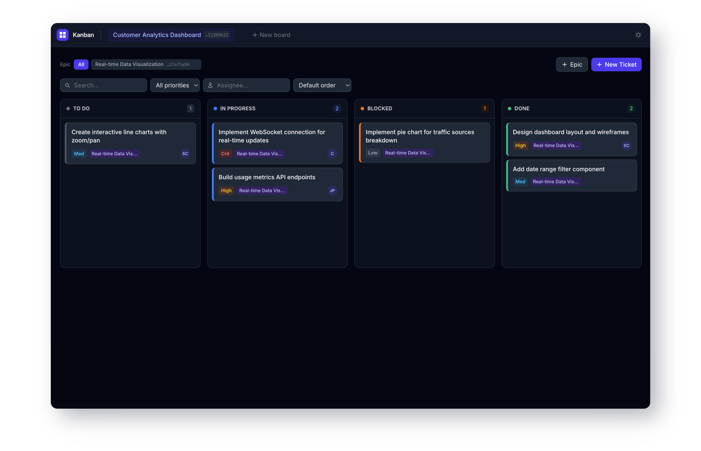

# kanban-mcp


Single-binary lightweight Kanban board with native MCP support — perfect local task memory AI coding agents



---

## How to use

<details>
<summary>Common ways to use kanban-mcp</summary>

### 1. Break down ideas into actionable tickets (planning phase)

Tell your AI agent your goal/idea in natural language. Once it's been discussed ask to break it down into tickets.

**Example prompt**:

```
Using board XYZ, add an epic for ABC and break down the work into tickets with tasks
```

### 2. Let your agent work (Execution phase)

Once tickets exist, hand over control.

**Example prompt**:

```
Review the "XYZ" board.
Focus on ready, unblocked tickets (use the 'ready' action).
Start working on the highest-priority ticket:
- Take notes on decisions/progress
- Check off completed tasks
- Update status to "in progress" → "done" when finished
- Record resolution details (commit SHA, PR link, etc.)

Loop until no ready tickets remain or you hit a blocker.
```

---

### Further prompts

You can talk in natural language and the AI agent will understand what you want to do

```
Create a board called Customer Analytics
---
Add a new epic for user authentication
---
Create tickets from what we've discussed
---
What should we work on next?
---
Keep working on the use endpoint API ticket
```

</details>

## Quick Start

### Download

Download a pre-built binary for your platfrom from the [releases](https://github.com/rgracey/kanban-mcp/releases) or use your terminal:

<details>
<summary>MacOS</summary>

**Note**: The binary is currently not signed, so it must be removed from quarantined

**Apple Silicon**

```sh
curl -fsSL https://github.com/rgracey/kanban-mcp/releases/latest/download/kanban-mcp-darwin-arm64.tar.gz | tar -xz - && chmod +x kanban-mcp && xattr -r -d com.apple.quarantine ./kanban-mcp
```

**Intel**

```sh
curl -fsSL https://github.com/rgracey/kanban-mcp/releases/latest/download/kanban-mcp-darwin-amd64.tar.gz | tar -xz - && chmod +x kanban-mcp && xattr -r -d com.apple.quarantine ./kanban-mcp
```

</details>

<details>
<summary>Linux</summary>

**x86**

```sh
curl -fsSL https://github.com/rgracey/kanban-mcp/releases/latest/download/kanban-mcp-linux-amd64.tar.gz | tar -xz - && chmod +x kanban-mcp
```

**ARM**

```sh
curl -fsSL https://github.com/rgracey/kanban-mcp/releases/latest/download/kanban-mcp-linux-arm64.tar.gz | tar -xz - && chmod +x kanban-mcp
```

</details>

<details>
<summary>Windows</summary>

**Note**: Instructions untested

**x86**

```sh
iwr https://github.com/rgracey/kanban-mcp/releases/latest/download/kanban-mcp-windows-amd64.zip -OutFile k.zip; Expand-Archive k.zip .; rm k.zip
```

**ARM**

```sh
iwr https://github.com/rgracey/kanban-mcp/releases/latest/download/kanban-mcp-windows-arm64.zip -OutFile k.zip; Expand-Archive k.zip .; rm k.zip
```

</details>

<details>
<summary>Build from source</summary>

**Prerequisites**

- [Go](https://go.dev/dl/) 1.22 or later

```sh
git clone https://github.com/rgracey/kanban-mcp
cd kanban-mcp
go build -o kanban-mcp .
./kanban-mcp
```

</details>

### Running

kanban-mcp can be used either as a standalone server or stdio.

> **Note**: The web UI will be available at `http://localhost:8080` or on whatever port you have [configured](#configuration-options)

<details>
<summary>Quick commands</summary>

#### Adding HTTP server to Claude Code

```
claude mcp add --transport http kanban http://localhost:8080/mcp
```

#### Adding stdio server to Claude Code

```
claude mcp add kanban -- /path/to/your/kanban-mcp
```

</details>

#### Standalone

You run kanban-mcp outside of your coding tool and have agents connect to it remotely.

In a terminal, run

```
./kanban-mcp
```

This will start kanban-mcp on port `8080` by default. See [Configuration](#configuration-options) for more information.

In your coding tool, configure your MCP servers to point to the now running kanban server

##### opencode example

```
"mcp": {
  "kanban": {
    "type": "remote",
    "url": "http://localhost:8080/mcp"
  },
}
```

#### Using stdio

Point the MCP to the path where your kanban-mcp binary is

##### opencode example

```
"kanban": {
  "type": "local",
  "command": [
    "/path/to/your/kanban-mcp"
  ]
}
```

### Configuration options

Flags take precedence over environment variables.

| Flag              | Env var                | Default     | Description                      |
| ----------------- | ---------------------- | ----------- | -------------------------------- |
| `--port`          | `KANBAN_PORT`          | `8080`      | HTTP listen port                 |
| `--db`            | `KANBAN_DB`            | `kanban.db` | Path to the SQLite database file |
| `--mcp-transport` | `KANBAN_MCP_TRANSPORT` | `stdio`     | `stdio`, `http`, or `both`       |
| `--log-level`     | `KANBAN_LOG_LEVEL`     | `info`      | `debug`, `info`, `warn`, `error` |

The database file is created automatically on first run. Migrations are applied automatically on startup.

---

## Features

- **Boards, epics, and tickets** with status (`todo` / `in progress` / `blocked` / `done`) and priority (`low` / `medium` / `high` / `critical`)
- **Checklists** — per-ticket task lists for progress tracking
- **Notes** — durable agent scratchpad on tickets to keep progress/findings
- **Blocking relations** — tickets can block other tickets; `ready` action returns unblocked work
- **Bulk create** — create multiple tickets in a single call
- **Assignees** — free-text assignee field per ticket
- **Markdown** rendering in ticket descriptions
- **Audit history** — every create, edit, move, note, and task change is recorded and shown in a timeline on the ticket
- **Real-time updates** — the UI reacts to changes via Server-Sent Events (no polling, no refresh required)
- **Dark mode** — user toggle, persisted in localStorage
- **MCP server** — 6 action-dispatched tools covering the full data model
- **Zero external dependencies** — SQLite, frontend assets, and MCP all embedded in one binary

---

## Development

### Prerequisites

- Go 1.22+
- Node.js 20+

### Running locally

Run the backend and the Vite dev server in separate terminals. The Vite dev server proxies `/api` requests to the Go backend.

```sh
# Terminal 1 — Go backend
go run .

# Terminal 2 — frontend with hot reload
cd frontend && npm install && npm run dev
```

Frontend: `http://localhost:5173`  
Backend API: `http://localhost:8080`

### Tests

```sh
go test ./...
```

### Building the frontend

The compiled frontend (`frontend/dist/`) is committed to the repository so that `go build` works without Node. If you change frontend source files, rebuild and commit the dist:

```sh
cd frontend && npm run build # OR go generate ./frontend
git add frontend/dist/
```

### Building the binary

```sh
go build -o kanban-mcp .
```

---

<details>
<summary>REST API Reference (click to expand)</summary>
Base path: `/api/v1`. All responses are JSON. All IDs are UUID v4. Timestamps are RFC3339.

<details>
<summary>Boards</summary>

| Method   | Path                         | Description                                        |
| -------- | ---------------------------- | -------------------------------------------------- |
| `GET`    | `/api/v1/boards`             | List all boards                                    |
| `POST`   | `/api/v1/boards`             | Create a board (`name` required)                   |
| `GET`    | `/api/v1/boards/:id`         | Get a board                                        |
| `PUT`    | `/api/v1/boards/:id`         | Update a board (partial)                           |
| `DELETE` | `/api/v1/boards/:id`         | Delete a board (cascades to epics, tickets, notes) |
| `GET`    | `/api/v1/boards/:id/summary` | Ticket counts by status + epic breakdown           |

</details>

<details>
<summary>Epics</summary>

| Method   | Path                       | Description                                              |
| -------- | -------------------------- | -------------------------------------------------------- |
| `GET`    | `/api/v1/boards/:id/epics` | List epics for a board                                   |
| `POST`   | `/api/v1/boards/:id/epics` | Create an epic (`title` required)                        |
| `GET`    | `/api/v1/epics/:id`        | Get an epic                                              |
| `PUT`    | `/api/v1/epics/:id`        | Update an epic (partial)                                 |
| `DELETE` | `/api/v1/epics/:id`        | Delete an epic (tickets are kept, `epic_id` set to null) |

</details>

<details>
<summary>Tickets</summary>

| Method   | Path                         | Description                                                                          |
| -------- | ---------------------------- | ------------------------------------------------------------------------------------ |
| `GET`    | `/api/v1/boards/:id/tickets` | List tickets (filter: `status`, `priority`, `epic_id`, `q`, `sort_by`, `sort_order`) |
| `POST`   | `/api/v1/boards/:id/tickets` | Create a ticket (`title` required; defaults: `status=todo`, `priority=medium`)       |
| `GET`    | `/api/v1/tickets/:id`        | Get a ticket                                                                         |
| `PUT`    | `/api/v1/tickets/:id`        | Update a ticket (any subset of fields; `epic_id: null` clears the epic)              |
| `DELETE` | `/api/v1/tickets/:id`        | Delete a ticket (cascades to notes and tasks)                                        |

</details>

<details>
<summary>Tasks</summary>

| Method   | Path                        | Description                      |
| -------- | --------------------------- | -------------------------------- |
| `GET`    | `/api/v1/tickets/:id/tasks` | List tasks for a ticket          |
| `POST`   | `/api/v1/tickets/:id/tasks` | Create a task (`title` required) |
| `PUT`    | `/api/v1/tasks/:id`         | Update a task (`title`, `done`)  |
| `DELETE` | `/api/v1/tasks/:id`         | Delete a task                    |

</details>

<details>
<summary>Notes</summary>

| Method   | Path                        | Description                              |
| -------- | --------------------------- | ---------------------------------------- |
| `GET`    | `/api/v1/tickets/:id/notes` | List notes (ordered by `created_at` asc) |
| `POST`   | `/api/v1/tickets/:id/notes` | Add a note (`body` required)             |
| `GET`    | `/api/v1/notes/:id`         | Get a note                               |
| `PUT`    | `/api/v1/notes/:id`         | Update a note (`body` required)          |
| `DELETE` | `/api/v1/notes/:id`         | Delete a note                            |

</details>

<details>
<summary>Blocking relations</summary>

| Method   | Path                                  | Description                                       |
| -------- | ------------------------------------- | ------------------------------------------------- |
| `GET`    | `/api/v1/tickets/:id/relations`       | List tickets blocked by this ticket               |
| `POST`   | `/api/v1/tickets/:id/relations`       | Add a blocking relation (`to_ticket_id` required) |
| `DELETE` | `/api/v1/tickets/:id/relations/:toId` | Remove a blocking relation                        |

</details>

<details>
<summary>Audit history</summary>

| Method | Path                         | Description                                                  |
| ------ | ---------------------------- | ------------------------------------------------------------ |
| `GET`  | `/api/v1/tickets/:id/events` | List audit events for a ticket (ordered by `created_at` asc) |

</details>

<details>
<summary>Real-time events (SSE)</summary>

`GET /api/v1/boards/:id/events` — Server-Sent Events stream. Emits an event whenever a ticket on the board is created, updated, or deleted. The UI uses this to refresh without polling.

</details>
</details>

<details>
<summary>MCP Tools Reference (click to expand)</summary>
All tools use an action-dispatch pattern: one tool per resource, with an `action` parameter selecting the operation. List actions return `{"items": [...]}` (an object wrapper required by the MCP spec).

| Tool       | Actions                                                                    | Key parameters                                                                                                                                                                                                                                                                                                                                                   |
| ---------- | -------------------------------------------------------------------------- | ---------------------------------------------------------------------------------------------------------------------------------------------------------------------------------------------------------------------------------------------------------------------------------------------------------------------------------------------------------------- |
| `board`    | `list`, `get`, `create`, `update`, `delete`, `summary`, `context`, `ready` | `id` or `name` (get/summary/context/ready accept either); `description`; context: `filter_status`, `omit_descriptions`; ready: returns unblocked todo tickets sorted by priority                                                                                                                                                                                 |
| `epic`     | `list`, `get`, `create`, `update`, `delete`                                | `id`, `board_id`, `title`, `description`                                                                                                                                                                                                                                                                                                                         |
| `ticket`   | `list`, `get`, `create`, `bulk_create`, `update`, `delete`, `history`      | `id`, `board_id`, `title`, `description`, `status`, `priority`, `epic_id`, `assignee`, `resolution_json`; list: `filter_status`, `filter_priority`, `filter_epic_id`, `filter_assignee`, `q` (searches title + description), `sort_by`, `sort_order`; get: `include_notes`, `include_history`, `include_tasks`, `include_relations`; bulk_create: `tickets_json` |
| `task`     | `list`, `create`, `update`, `delete`                                       | `id`, `ticket_id`, `title`, `done`                                                                                                                                                                                                                                                                                                                               |
| `note`     | `list`, `add`, `update`, `delete`                                          | `id`, `ticket_id`, `body`                                                                                                                                                                                                                                                                                                                                        |
| `relation` | `list`, `add`, `delete`                                                    | `ticket_id`, `to_ticket_id`                                                                                                                                                                                                                                                                                                                                      |

### Special actions

- **`board context`** — Returns a complete snapshot: board metadata, all epics, and all tickets with embedded tasks and blocking relations. Use this instead of multiple list calls when you need the full picture. `filter_status` and `omit_descriptions` reduce token usage on large boards.
- **`board ready`** — Returns unblocked `todo` tickets ordered by priority (critical → low). Use this to get an agent's immediate work queue.
- **`ticket bulk_create`** — Create multiple tickets in one call via `tickets_json` (a JSON array of ticket objects).
- **`resolution_json`** — On ticket create/update, record structured resolution data (e.g., `{"commit_sha":"abc123","pr_url":"https://...","notes":"Fixed by ..."}`). Pass `"null"` to clear.
</details>
